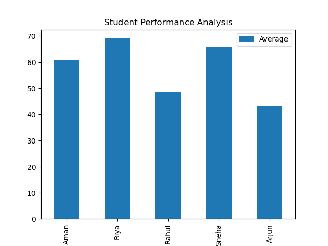

# 📊 Student Performance Analytics — Python

An academic data analysis system built with Python and Pandas.
Loads student marks from CSV, computes scores and averages,
classifies grades automatically, ranks students, and produces
visual performance reports with Matplotlib.

---

## 🚀 Features

- Loads student data from `students.csv`
- Computes total marks and subject-wise averages per student
- Automated grade classification — Distinction / First Class / Pass / Fail
- Ranks students by total marks in descending order
- Exports final graded report to `final_report.csv`
- Bar chart visualization of grade distribution

---

## 🛠️ Tech Stack

| Tool | Purpose |
|---|---|
| Python 3.x | Core programming language |
| Pandas | Data loading, processing, and aggregation |
| Matplotlib | Performance chart visualization |
| Jupyter Notebook | Interactive analysis and output |
| CSV | Input data and output report |

---

## ▶️ How to Run

**Option 1 — Run locally:**

```bash
git clone https://github.com/Sweta-Sharma2002/student-performance-analytics.git
cd student-performance-analytics
pip install pandas matplotlib
jupyter notebook Student_Performance_Analyzer.ipynb
```

**Option 2 — Run on Google Colab (no installation needed):**

Open [Google Colab](https://colab.research.google.com), click `File → Open notebook → GitHub`, paste the repo URL and open `Student_Performance_Analyzer.ipynb`.

---

## 📁 Project Structure

student-performance-analytics/
├── Student_Performance_Analyzer.ipynb  # Main analysis notebook
├── students.csv                        # Input — raw student marks data
├── final_report.csv                    # Output — graded and ranked report
├── performance_chart.png               # Output — grade distribution chart
└── README.md

---

## ⚙️ How It Works

1. **Load Data** — `students.csv` is read using Pandas. Contains student names and subject-wise marks.
2. **Calculate Scores** — Total marks and average percentage are computed per student.
3. **Grade Classification** — Each student is assigned a grade using configurable thresholds:

| Grade | Percentage |
|---|---|
| Distinction | 75% and above |
| First Class | 60% – 74% |
| Pass | 40% – 59% |
| Fail | Below 40% |

4. **Ranking** — Students are sorted and ranked by total marks in descending order.
5. **Export** — Final report with grades and ranks is saved to `final_report.csv`.
6. **Visualize** — A bar chart shows the number of students in each grade category.

---

## 📈 Sample Output



| Student | Total | Average % | Grade | Rank |
|---|---|---|---|---|
| Alice | 432 | 86.4% | Distinction | 1 |
| Bob | 374 | 74.8% | First Class | 2 |
| Carol | 298 | 59.6% | Pass | 3 |
| David | 189 | 37.8% | Fail | 4 |

---

## 🧠 What I Learned

- End-to-end data analysis pipeline — load, clean, process, visualize, export
- Pandas `groupby`, aggregation, and conditional logic for classification
- Saving processed output back to CSV for reporting
- Generating clean bar charts with Matplotlib
- Structuring a data project so results are reproducible and shareable

---

## 🔮 Future Improvements

- Attendance data integration and correlation analysis with marks
- Subject-wise weak area detection per student
- Interactive dashboard using Plotly or Streamlit
- Support for multiple classes and semesters

---

## 👩‍💻 Author

**Sweta Sharma**  

[](https://github.com/Sweta-Sharma2002)
[](https://linkedin.com/in/swetasharma)
[](mailto:swetashr08@gmail.com)
